# Use Case Diagram — Sơ Đồ Ca Sử Dụng
# Hệ Thống Quản Lý CV

> **Chú thích:** Xem bảng giải nghĩa thuật ngữ tại [00_glossary.md](./00_glossary.md)

---

## Actors (Tác nhân)

| Actor (Tác nhân) | Nghĩa | Mô tả |
|---|---|---|
| **Employee** | Nhân viên | Xem và chỉnh sửa CV của chính mình |
| **Tech Lead** | Trưởng nhóm kỹ thuật | Duyệt bản nháp CV ở Trạm 1 |
| **HR** | Nhân sự | Toàn quyền quản lý, duyệt bản nháp CV ở Trạm 2 |
| **System** | Hệ thống | Thực hiện tự động (clone CV, nâng version, thông báo) |

---

## Use Case Diagram (Sơ đồ ca sử dụng)

```mermaid
%%{init: {"theme": "default", "themeVariables": {"fontSize": "14px"}}}%%
graph TD
    subgraph Actors["Tác nhân (Actors)"]
        EMP["👤 Employee\n(Nhân viên)"]
        TL["👤 Tech Lead\n(Trưởng nhóm)"]
        HR_["👤 HR\n(Nhân sự)"]
        SYS["⚙️ System\n(Hệ thống)"]
    end

    subgraph UC["🖥️ CV Management System — Hệ thống quản lý CV"]
        direction TB

        subgraph AUTH["🔐 Xác thực (Authentication)"]
            UC1["UC1: Đăng nhập\n(Login)"]
        end

        subgraph CV_OWN["📄 Quản lý CV cá nhân (Personal CV Management)"]
            UC2["UC2: Xem CV của mình\n(View own CV)"]
            UC3["UC3: Tạo bản nháp CV\n(Create CV Draft)"]
            UC4["UC4: Chỉnh sửa bản nháp\n(Edit Draft)"]
            UC5["UC5: Nộp bản nháp để duyệt\n(Submit Draft for Approval)"]
        end

        subgraph NOTIF["🔔 Thông báo (Notification)"]
            UC6["UC6: Nhận thông báo\n(Receive Notification)"]
            UC7["UC7: Đọc thông báo\n(Read Notification)"]
        end

        subgraph TL_UC["✅ Duyệt Trạm 1 (Approval Station 1)"]
            UC8["UC8: Xem DS bản nháp chờ duyệt\n(View Pending Drafts)"]
            UC9["UC9: Duyệt bản nháp Trạm 1\n(Approve Draft — Station 1)"]
            UC10["UC10: Từ chối bản nháp Trạm 1\n(Reject Draft — Station 1)"]
        end

        subgraph HR_UC["🏢 Quản lý HR (HR Management)"]
            UC11["UC11: Tạo yêu cầu cập nhật CV\n(Create CV Update Request)"]
            UC12["UC12: Hủy yêu cầu cập nhật CV\n(Cancel CV Update Request)"]
            UC13["UC13: Xem toàn bộ CV nhân viên\n(View All Employee CVs)"]
            UC14["UC14: Duyệt bản nháp Trạm 2\n(Approve Draft — Station 2)"]
            UC15["UC15: Từ chối bản nháp Trạm 2\n(Reject Draft — Station 2)"]
            UC16["UC16: Xem lịch sử duyệt CV\n(View Approval History/Log)"]
            UC17["UC17: Quản lý nhân viên\n(Manage Employees)"]
        end

        subgraph SYS_UC["⚙️ Tự động hệ thống (System Auto Actions)"]
            UC18["UC18: Clone CV gốc → bản nháp\n(Clone CV to Draft)"]
            UC19["UC19: Nâng version CV gốc\n(Upgrade CV Version)"]
            UC20["UC20: Smart Routing bỏ qua Trạm 1\n(Smart Routing — Skip Station 1)"]
            UC21["UC21: Gửi thông báo tự động\n(Send Auto Notification)"]
        end
    end

    EMP --> UC1
    EMP --> UC2
    EMP --> UC3
    EMP --> UC4
    EMP --> UC5
    EMP --> UC6
    EMP --> UC7

    TL --> UC1
    TL --> UC8
    TL --> UC9
    TL --> UC10
    TL --> UC6
    TL --> UC7

    HR_ --> UC1
    HR_ --> UC11
    HR_ --> UC12
    HR_ --> UC13
    HR_ --> UC14
    HR_ --> UC15
    HR_ --> UC16
    HR_ --> UC17
    HR_ --> UC6
    HR_ --> UC7

    SYS --> UC18
    SYS --> UC19
    SYS --> UC20
    SYS --> UC21

    UC11 -->|"triggers — kích hoạt"| UC18
    UC9  -->|"triggers — kích hoạt"| UC21
    UC10 -->|"triggers — kích hoạt"| UC21
    UC14 -->|"triggers — kích hoạt"| UC19
    UC14 -->|"triggers — kích hoạt"| UC21
    UC15 -->|"triggers — kích hoạt"| UC20
    UC15 -->|"triggers — kích hoạt"| UC21
    UC5  -->|"include — bao gồm"| UC4
```



---

## Danh sách 21 Use Cases (Ca sử dụng)

### 👤 Employee — Nhân viên
| UC | Tên (EN) | Tên (VI) | Mô tả |
|---|---|---|---|
| UC1 | Login | Đăng nhập | Xác thực bằng username/password |
| UC2 | View own CV | Xem CV của mình | Xem CV hiện hành (version đang active) |
| UC3 | Create CV Draft | Tạo bản nháp CV | Tạo CvDraft từ CV gốc (hệ thống clone tự động) |
| UC4 | Edit Draft | Chỉnh sửa bản nháp | Sửa fullName, phone, summary, objective, experiences, educations, skills |
| UC5 | Submit Draft | Nộp bản nháp để duyệt | Chuyển Draft từ DRAFTING → PENDING_TECH (hoặc PENDING_HR nếu Smart Routing) |
| UC6 | Receive Notification | Nhận thông báo | Nhận Notification khi có kết quả duyệt |
| UC7 | Read Notification | Đọc thông báo | Đánh dấu isRead = true |

### 👤 Tech Lead — Trưởng nhóm kỹ thuật
| UC | Tên (EN) | Tên (VI) | Mô tả |
|---|---|---|---|
| UC1 | Login | Đăng nhập | Xác thực bằng username/password |
| UC8 | View Pending Drafts | Xem danh sách bản nháp chờ duyệt | Xem CvDraft có status = PENDING_TECH trong phòng ban |
| UC9 | Approve Draft (Station 1) | Duyệt bản nháp Trạm 1 | Ghi ApprovalLog: APPROVED_BY_TECH, draft → PENDING_HR |
| UC10 | Reject Draft (Station 1) | Từ chối bản nháp Trạm 1 | Ghi ApprovalLog: REJECTED_BY_TECH, ghi rejectionNote |

### 👤 HR — Nhân sự
| UC | Tên (EN) | Tên (VI) | Mô tả |
|---|---|---|---|
| UC11 | Create CV Update Request | Tạo yêu cầu cập nhật CV | Tạo CvUpdateRequest cho Employee, đặt deadline |
| UC12 | Cancel CV Update Request | Hủy yêu cầu cập nhật CV | Hủy RequestStatus, Draft liên quan → CANCELED |
| UC13 | View All Employee CVs | Xem toàn bộ CV nhân viên | Master Dashboard — xem Cv của tất cả nhân viên |
| UC14 | Approve Draft (Station 2) | Duyệt bản nháp Trạm 2 | Ghi ApprovalLog: APPROVED_BY_HR, nâng version CV gốc |
| UC15 | Reject Draft (Station 2) | Từ chối bản nháp Trạm 2 | Ghi ApprovalLog: REJECTED_BY_HR, kích hoạt Smart Routing |
| UC16 | View Approval Log | Xem lịch sử duyệt CV | Xem bảng CvApprovalLog — toàn bộ lịch sử |
| UC17 | Manage Employees | Quản lý nhân viên | Xem/vô hiệu hóa tài khoản (isActive) |

### ⚙️ System — Hệ thống (Tự động)
| UC | Tên (EN) | Tên (VI) | Mô tả |
|---|---|---|---|
| UC18 | Clone CV to Draft | Clone CV gốc → bản nháp | Copy toàn bộ nội dung Cv → CvDraft mới |
| UC19 | Upgrade CV Version | Nâng version CV gốc | Cv.version++, bản cũ isActive=false, bản mới isActive=true |
| UC20 | Smart Routing | Định tuyến thông minh | Bỏ qua Trạm 1, thẳng lên PENDING_HR |
| UC21 | Send Auto Notification | Gửi thông báo tự động | Tạo Notification cho user liên quan sau mỗi sự kiện |

---

## Luồng chính (Main Flow / Happy Path)

```
[UC11] HR tạo yêu cầu (Create CV Update Request)
    → [UC18] System clone CV thành Draft (Clone CV to Draft)
    → [UC04] Employee chỉnh sửa Draft (Edit Draft)
    → [UC05] Employee nộp Draft (Submit Draft) → PENDING_TECH
    → [UC09] Tech Lead duyệt Trạm 1 (Approve Station 1) → PENDING_HR
    → [UC14] HR duyệt Trạm 2 (Approve Station 2) → HOÀN TẤT
    → [UC19] System nâng version CV gốc (Upgrade CV Version)
    → [UC21] System gửi thông báo (Send Notification)
```
